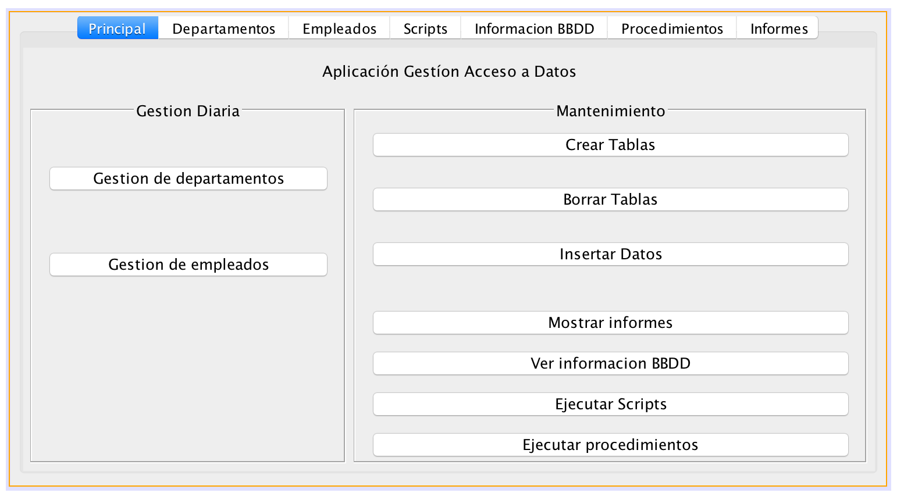
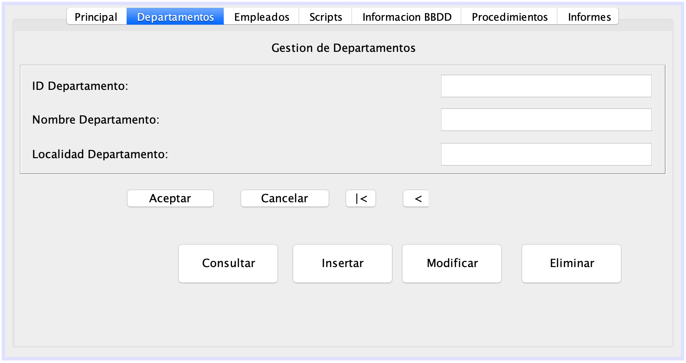
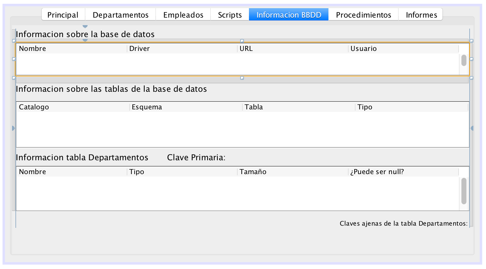
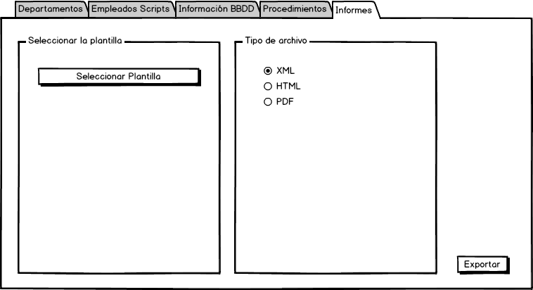

# sesion7-tarea-grupo
Tarea en Grupo GitHub Classroom Sesión 7

Aplicación de Gestión

# Introducción

En este tema vamos a realizar la primera de nuestras aplicaciones gráficas. Vamos a crear una aplicación de gestión de una base de datos de una empresa donde se guardará información sobre empleados y departamentos. Utilizaremos el servidor de bases de datos Mysql que nos permitirá evitar errores de acceso concurrente como ocurre con las bases de datos embebidas. En este servidor se ejecutará el siguiente script para crear la estructura de la base de datos.

```sql
CREATE TABLE departamentos(
dept_no TINYINT(2) NOT NULL PRIMARY KEY,
dnombre VARCHAR(15),
loc VARCHAR(15)
) ENGINE=InnoDB; 

CREATE TABLE empleados (
emp_no SMALLINT(4) NOT NULL PRIMARY KEY,
apellido VARCHAR(10),
oficio VARCHAR(10),
dir SMALLINT,
fecha_alt DATE,
salario FLOAT,
comision FLOAT,
dept_no TINYINT(2) NOT NULL,
CONSTRAINT FK_DEP FOREIGN KEY (dept_no) REFERENCES departamentos (dept_no)
) ENGINE=InnoDB;

INSERT INTO departamentos VALUES (10,'CONTABILIDAD','SEVILLA');
INSERT INTO departamentos VALUES (20,'INVESTIGACIÓN','MADRID');
INSERT INTO departamentos VALUES (30,'VENTAS','BARCELONA');
INSERT INTO departamentos VALUES (40,'PRODUCCIÓN','BILBAO');

INSERT INTO empleados VALUES (7369,'SANCHEZ','EMPLEADO',7521,'1990-12-17',1040,NULL,20);
INSERT INTO empleados VALUES (7499,'ARROYO','VENDEDOR',7369,'1990-02-20',1500,390,30);
INSERT INTO empleados VALUES (7521,'SALA','VENDEDOR',7369,'1991-02-22',1625,650,30);
```


# Aplicación Gráfica

Para desarrollar nuestra primera aplicación gráfica que acceda a bases de datos, podemos tener una interfaz parecida a esta. Por una parte, implementaremos un apartado de gestión de departamentos y empleados en los que realizar las funciones más comunes en las tablas (Consulta, Inserción, Modificación y Borrado). Por otra parte, tenemos un apartado donde se realizarán operaciones de mantenimiento de la base de datos (Creación y Borrado de tablas, Ejecución de scripts y procedimientos, Acceso a los metadatos, etc..)

Los apartados Crear Tablas, Borrar Tablas e Insertar Datos, permitirán crear las tablas de ejemplo utilizadas, borrar las mismas e insertar datos de ejemplo dentro de estas respectivamente. Para ejecutar estas sentencias SQL utilizaremos una instancia de la clase *Statement *mediante la ejecución del método *executeUpdate(String).*



## Gestión Departamentos y Empleados

Para la gestión de departamentos y empleados necesitamos implementar las funciones más comunes que se pueden realizar con las tablas de una base de datos. Consultas, inserciones, modificaciones y borrados son las operaciones que se podrán dar en este apartado de la aplicación. 

*Posibles Consideraciones:*

* Se pueden cargar los datos inicialmente, cuando la pestaña se active.

* Se tendrá que desarrollar un mecanismo para que se acepten o cancelen cambios, borrados o inserciones.

* Se deberá insertar botones que permitan al usuario moverse por los registros, por ejemplo los registros que devuelve una consulta. 

* Algunos métodos ejecutados por los diversos botones utilizarán resultados compartidos. Por ejemplo, al eliminar un registro que previamente se haya consultado.

Un ejemplo de la interfaz para este apartado puede ser el siguiente:



La interfaz del apartado de gestión de empleados puede ser similar a este que hemos visto con algunas consideraciones:

* Para ejemplificar el uso de componentes *JComboBox*, se pueden implementar los campos de Departamento y Director con uno de estos componentes.

## Ejecución de Scripts

En la pestaña de nombrada como Scripts vamos a realizar la ejecución de un script de base de datos, para ello tendremos que permitir al usuario que selecciones el fichero que contiene esas instrucciones que se ejecutarán en la base de datos. 

Por una parte utilizaremos un *JTextArea* para mostrar el contenido del fichero que leeremos desde disco y que contiene las instrucciones que han de ser ejecutadas. Además también se introducirán un par de botones para permitir la apertura de fichero mediante un *JFileChooser* y permitir la ejecución del mismo sobre la base de datos. En este segundo botón se puede solicitar confirmación al usuario mediante un *JOptionPane.showConfirmDialog*

## Información de la Base de Datos



En una pantalla similar a la siguiente tendremos que implantar la lectura de los metadatos contenidos en la base de datos. Primeramente, mediante un componente *JTable* obtendremos información sobre la propia base de datos incluido el nombre de la base de datos, el driver utilizado para acceder a ella, la URL que nos permite conectar a la misma y el usuario con el que realizamos la conexión.

Seguidamente, implementaremos otro *JTable* donde obtendremos la información del catálogo, esquema tabla y tipo de la misma de todas las tablas que contiene la base de datos a la que estamos conectando.

Para finalizar, implementaremos el último de los *JTable* donde mostraremos el nombre, tipo, tamaño y si puede o no puede ser nulo de la tabla Departamentos. Además, también mostraremos junto con dos etiquetas los campos que componen la clave primaria y las claves ajenas de la misma.

## Procedimientos

En la pestaña de nombrada como Procedimientos, vamos a realizar de una serie de procedimientos que están almacenados en la base de datos. Para ello y con componente *JList* en el que mostraremos los procedimientos y que permitirá al usuario seleccionar aquel que quiere ejecutar.

También utilizaremos un botón que permitirá al usuario, después de seleccionar uno de los procedimientos, proceder a ejecutarlo.

## Informes

En la pestaña informes se utilizará la librería JasperReports para generar informes a partir de la información almacenada en la base de datos. Para ello tenemos que definir una plantilla y podemos utilizar el software [JasperSoft Studio](https://community.jaspersoft.com/project/jaspersoft-studio) y con la librería realizar una combinación de la información que hay almacenada en la base de datos a diversos formatos.

Se propone la siguiente interfaz como ejemplo para poder realizar la exportación a de informes a diversos formatos.

Crea una plantilla con JasperReports para la creación de un informe de los empleados almacenados en la base de datos.



